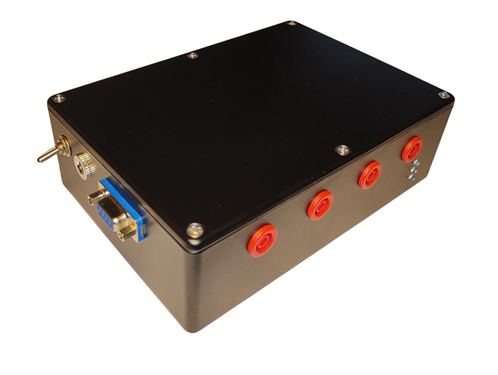
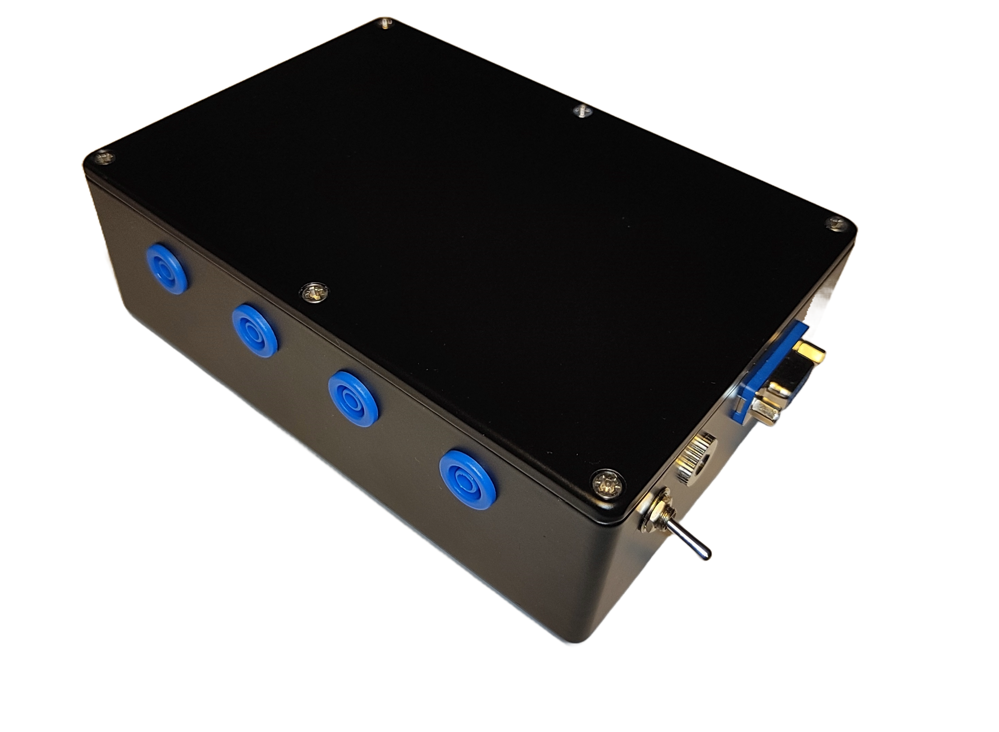
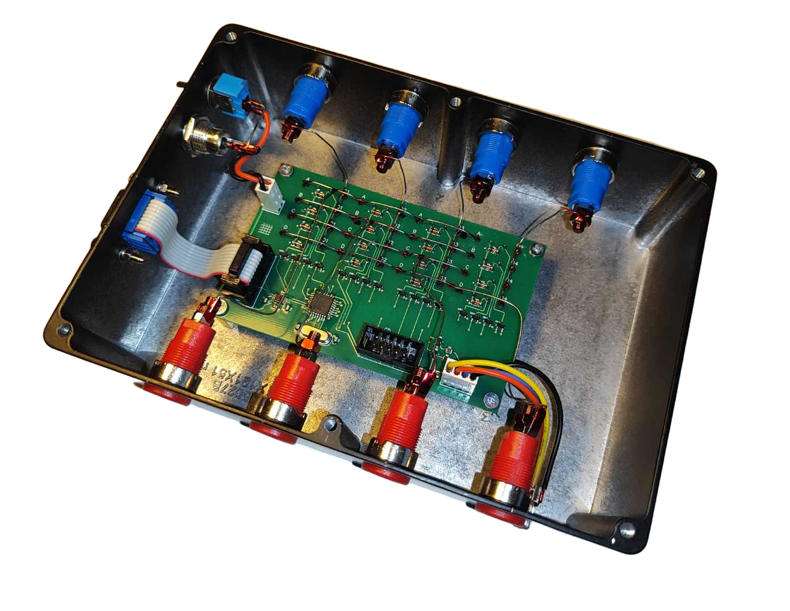
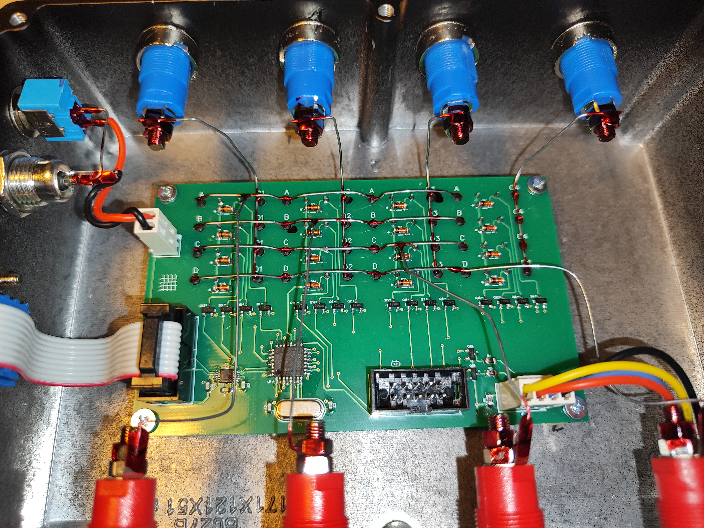

# Analog commutator 4x4 for automation of Hall effect measurement.

**Русский:**  
Программно-аппаратный комплекс для управления аналоговым коммутатором 4×4, предназначенным для автоматизации измерений эффекта Холла по методу Ван-дер-Пау. Состоит из драйверов для MATLAB, Python и LabVIEW, а также конструкции печатной платы.

**English:**  
A software/hardware package for controlling a 4×4 analog switch matrix designed to automate Hall‑effect measurements (Van der Pauw method). Includes MATLAB, Python and LabVIEW drivers, plus the PCB design of the relay matrix.

---

## Software

### MATLAB R2021b

**Русский:**  
- **Зависимости:** класс `aDevice` из модуля [Automation devices module](https://github.com/AleksandrVakulenko/Automation_device_class) пакетного менеджера [Fern](https://github.com/AleksandrVakulenko/Fern).  
- **Использование:**  
  1. Установите Fern.  
  2. Каждый раз после запуска MATLAB выполните `Fern.load('aDevice')`.  
  3. Создайте объект устройства: `Box = Hall_box(COM_port);`  
  4. Отправляйте команды, например: `Box.set_relay('ABCD');`  
- **Примеры:** `Matlab/TEST/Test_01.m`, `Matlab/TEST/Test_02.m`

**English:**  
- **Dependencies:** `aDevice` class from the [Automation devices module](https://github.com/AleksandrVakulenko/Automation_device_class) of the [Fern](https://github.com/AleksandrVakulenko/Fern) package manager.  
- **Usage:**  
  1. Set up Fern.  
  2. Run `Fern.load('aDevice')` every time after starting MATLAB.  
  3. Create the device object: `Box = Hall_box(COM_port);`  
  4. Send commands, e.g.: `Box.set_relay('ABCD');`  
- **Examples:** `Matlab/TEST/Test_01.m`, `Matlab/TEST/Test_02.m`

### Python

**Русский:**  
- **Зависимости:** библиотека `pyserial`.  
- **Использование:**  
  1. Установите pyserial: `python3 -m pip install pyserial`  
  2. Импортируйте класс: `from Hall_box import HallBox`  
  3. Создайте объект: `box = HallBox(com_port)`  
  4. Выполняйте команды: `err_status, err_no, err_comment = box.set_relay('ABCD')`  
- **Примеры:** `Python/Test_02.py`

**English:**  
- **Dependencies:** `pyserial`.  
- **Usage:**  
  1. Install pyserial: `python3 -m pip install pyserial`  
  2. Import the class: `from Hall_box import HallBox`  
  3. Create the device: `box = HallBox(com_port)`  
  4. Execute commands: `err_status, err_no, err_comment = box.set_relay('ABCD')`  
- **Examples:** `Python/Test_02.py`

### LabVIEW 17 (64‑bit)

**Русский:**  
- **Использование:**  
  1. Загрузите файлы библиотеки из папки `LabView` (выберите версию).  
  2. Инициализируйте соединение с помощью VI `Commutator_init`.  
  3. Отправляйте команды через VI `Commutator_query_CMD`.  
  4. Закрывайте соединение через VI `Commutator_close`.  
- **Пример:** `Demo_terminal.vi`

**English:**  
- **Usage:**  
  1. Download the library files from the `LabView` folder (select the appropriate version).  
  2. Initialize the connection using `Commutator_init.vi`.  
  3. Send commands with `Commutator_query_CMD.vi`.  
  4. Close the connection with `Commutator_close.vi`.  
- **Example:** `Demo_terminal.vi`

---

## Hardware

### Gerber‑file notation

**Русский:**  
Расширения Gerber‑файлов, входящих в проект, и соответствующие слои печатной платы.

**English:**  
Gerber file extensions included in the project and the corresponding PCB layers.

| Обозначение (Ext.) | Полное название (Full name) | Описание слоя (Layer description) |
|-------------------|-----------------------------|-----------------------------------|
| **GTO** | Gerber Top Overlay | Верхняя шелкография / маркировка (Top Silkscreen) |
| **GTS** | Gerber Top Solder mask | Верхняя паяльная маска (Top Solder Mask) |
| **GTL** | Gerber Top Layer | Верхний слой меди (Top Copper) |
| **GBL** | Gerber Bottom Layer | Нижний слой меди (Bottom Copper) |
| **GBS** | Gerber Bottom Solder mask | Нижняя паяльная маска (Bottom Solder Mask) |
| **GBO** | Gerber Bottom Overlay | Нижняя шелкография (Bottom Silkscreen) |
| **GKO** | Gerber Keep‑Out | Контур платы и запретные зоны (Board Outline / Keep‑Out) |
| **LXN** | Layer X (eXtra) Notes | Слой металлизированных и неметаллизированных отверстий (Plated & non‑plated holes) |

### Фотографии устройства / Device assembly photos

Фотографии собранного устройства.
*The photos below show the assembled device*

  
  

  
  

